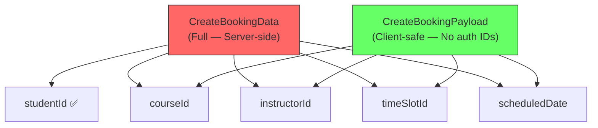

# Server-Injected Identity Pattern — Design & Refactoring Plan

## Problem Description

ปัญหาที่พบคือ **authenticated user IDs** (เช่น `studentId`, `instructorId`) ถูกรวมอยู่ใน `Create*Data` DTOs ระดับ interface ซึ่งเป็น contract ที่ client-side และ server-side ใช้ร่วมกัน

**ปัญหาปัจจุบัน:**

| ที่ | สิ่งที่เกิดขึ้น |
|-----|-----------------|
| [IBookingRepository.ts](file:///Users/marosdeeuma/live-learning-nextjs/src/application/repositories/IBookingRepository.ts) | [CreateBookingData](file:///Users/marosdeeuma/live-learning-nextjs/src/application/repositories/IBookingRepository.ts#37-44) มี `studentId: string` |
| [IConsultationRepository.ts](file:///Users/marosdeeuma/live-learning-nextjs/src/application/repositories/IConsultationRepository.ts) | [CreateConsultationRequestData](file:///Users/marosdeeuma/live-learning-nextjs/src/application/repositories/IConsultationRepository.ts#67-78) มี `studentId: string` |
| [IConsultationRepository.ts](file:///Users/marosdeeuma/live-learning-nextjs/src/application/repositories/IConsultationRepository.ts) | [CreateConsultationOfferData](file:///Users/marosdeeuma/live-learning-nextjs/src/application/repositories/IConsultationRepository.ts#79-88) มี `instructorId: string` |
| [ApiBookingRepository.ts](file:///Users/marosdeeuma/live-learning-nextjs/src/infrastructure/repositories/api/ApiBookingRepository.ts) | ต้อง destructure `const { studentId, ...payload } = data` แล้วไม่ส่ง |
| [ApiBookingWizardRepository.ts](file:///Users/marosdeeuma/live-learning-nextjs/src/infrastructure/repositories/api/ApiBookingWizardRepository.ts) | ส่ง placeholder `'me'` เป็น studentId (แฮ็ค) |
| [bookings/route.ts](file:///Users/marosdeeuma/live-learning-nextjs/app/api/bookings/route.ts) | ต้อง overwrite `studentId` ด้วย `profile.id` จาก auth |

> [!CAUTION]
> Client-side ไม่ควรส่ง authenticated user IDs เพราะสามารถปลอมแปลงได้ (IDOR vulnerability). Server ต้องเป็นผู้ resolve identity จาก session เสมอ.

---

## Pattern Naming: **Server-Injected Identity**

ปัญหานี้สามารถเรียกว่า **"Server-Injected Identity"** pattern ซึ่งมีหลักการว่า:

> **Identity ของผู้ใช้ที่ authenticated จะต้องถูก inject โดย server เท่านั้น — ห้ามรับจาก client**

คล้ายกับ concepts ใน security:
- **IDOR Prevention** (Insecure Direct Object Reference)
- **Server-Side Identity Resolution**
- **Implicit vs Explicit Identity Parameters**

---

## Proposed Solution: Split DTOs with `Omit<>`

### แนวคิดหลัก

แยก DTO ออกเป็น 2 ระดับ:



### วิธีทำ: ใช้ TypeScript `Omit<>` utility type

```typescript
// ============================================================
// 🔒 SERVER-INJECTED IDENTITY PATTERN
// ============================================================

/**
 * Full create data — used by SERVER-SIDE repositories only
 * Contains auth IDs that are injected by the server from session
 */
export interface CreateBookingData {
  studentId: string;        // 🔒 Server-injected from auth session
  instructorId: string;
  courseId: string;
  timeSlotId: string;
  scheduledDate: string;
}

/**
 * Client-safe payload — used by API repositories (client-side)
 * Auth IDs are stripped; server resolves them from session
 */
export type CreateBookingPayload = Omit<CreateBookingData, 'studentId'>;
```

### Interface แยก method signature ตาม context

```typescript
export interface IBookingRepository {
  // ...other methods...

  /**
   * Create a new booking
   * - Client implementation: sends CreateBookingPayload (no auth IDs)
   * - Server implementation: receives CreateBookingData (with server-injected IDs)
   */
  create(data: CreateBookingPayload): Promise<Booking>;
}
```

> [!IMPORTANT]
> Interface ใช้ `CreateBookingPayload` (client-safe) เป็น contract หลัก  
> Server-side [SupabaseBookingRepository](file:///Users/marosdeeuma/live-learning-nextjs/src/infrastructure/repositories/supabase/SupabaseBookingRepository.ts#28-324) จะ override ให้รับ [CreateBookingData](file:///Users/marosdeeuma/live-learning-nextjs/src/application/repositories/IBookingRepository.ts#37-44) โดยขยายจาก base type ผ่าน API route layer ที่ inject `studentId`

---

## Proposed Changes

### Application Layer

#### [MODIFY] [IBookingRepository.ts](file:///Users/marosdeeuma/live-learning-nextjs/src/application/repositories/IBookingRepository.ts)

- Add `CreateBookingPayload` type: `Omit<CreateBookingData, 'studentId'>`
- Change [create()](file:///Users/marosdeeuma/live-learning-nextjs/src/application/repositories/IBookingRepository.ts#57-58) method signature to use `CreateBookingPayload`
- Add JSDoc comment explaining the Server-Injected Identity pattern

```diff
 export interface CreateBookingData {
   studentId: string;
   instructorId: string;
   courseId: string;
   timeSlotId: string;
   scheduledDate: string;
 }

+/**
+ * 🔒 Server-Injected Identity Pattern
+ * Client-safe payload — auth IDs (studentId) are resolved server-side from session
+ */
+export type CreateBookingPayload = Omit<CreateBookingData, 'studentId'>;

 export interface IBookingRepository {
   // ...
-  create(data: CreateBookingData): Promise<Booking>;
+  create(data: CreateBookingPayload): Promise<Booking>;
   // ...
 }
```

---

#### [MODIFY] [IConsultationRepository.ts](file:///Users/marosdeeuma/live-learning-nextjs/src/application/repositories/IConsultationRepository.ts)

- Add `CreateConsultationRequestPayload`: `Omit<CreateConsultationRequestData, 'studentId'>`
- Add `CreateConsultationOfferPayload`: `Omit<CreateConsultationOfferData, 'instructorId'>`
- Update [createRequest()](file:///Users/marosdeeuma/live-learning-nextjs/src/application/repositories/IConsultationRepository.ts#96-97) and [createOffer()](file:///Users/marosdeeuma/live-learning-nextjs/src/application/repositories/IConsultationRepository.ts#105-106) method signatures

```diff
+export type CreateConsultationRequestPayload = Omit<CreateConsultationRequestData, 'studentId'>;
+export type CreateConsultationOfferPayload = Omit<CreateConsultationOfferData, 'instructorId'>;

 export interface IConsultationRepository {
-  createRequest(data: CreateConsultationRequestData): Promise<ConsultationRequest>;
+  createRequest(data: CreateConsultationRequestPayload): Promise<ConsultationRequest>;
   // ...
-  createOffer(data: CreateConsultationOfferData): Promise<ConsultationOffer>;
+  createOffer(data: CreateConsultationOfferPayload): Promise<ConsultationOffer>;
 }
```

---

### Infrastructure Layer

#### [MODIFY] [ApiBookingRepository.ts](file:///Users/marosdeeuma/live-learning-nextjs/src/infrastructure/repositories/api/ApiBookingRepository.ts)

- Change [create()](file:///Users/marosdeeuma/live-learning-nextjs/src/application/repositories/IBookingRepository.ts#57-58) parameter from [CreateBookingData](file:///Users/marosdeeuma/live-learning-nextjs/src/application/repositories/IBookingRepository.ts#37-44) to `CreateBookingPayload`
- Remove the `const { studentId, ...payload } = data` destructuring hack
- Send `data` directly (it no longer contains `studentId`)

```diff
-  async create(data: CreateBookingData): Promise<Booking> {
-    const { studentId, ...payload } = data;
+  async create(data: CreateBookingPayload): Promise<Booking> {
     const res = await fetch(this.baseUrl, {
       method: 'POST',
       headers: { 'Content-Type': 'application/json' },
-      body: JSON.stringify(payload),
+      body: JSON.stringify(data),
     });
```

---

#### [MODIFY] [ApiBookingWizardRepository.ts](file:///Users/marosdeeuma/live-learning-nextjs/src/infrastructure/repositories/api/ApiBookingWizardRepository.ts)

- Remove the `'studentId': 'me'` placeholder hack and all related comments
- Clean up the [createBooking()](file:///Users/marosdeeuma/live-learning-nextjs/src/application/repositories/IBookingWizardRepository.ts#50-51) method

```diff
     return this.bookingRepo.create({
-        'studentId': 'me',
         instructorId: data.instructorId,
         courseId: data.courseId,
         timeSlotId: data.slotId,
         scheduledDate: data.date
     });
```

---

#### [MODIFY] [SupabaseBookingRepository.ts](file:///Users/marosdeeuma/live-learning-nextjs/src/infrastructure/repositories/supabase/SupabaseBookingRepository.ts)

- Change [create()](file:///Users/marosdeeuma/live-learning-nextjs/src/application/repositories/IBookingRepository.ts#57-58) to accept `CreateBookingPayload` in the interface
- But the actual usage in [bookings/route.ts](file:///Users/marosdeeuma/live-learning-nextjs/app/api/bookings/route.ts) already passes the full object with `studentId` injected
- Solution: the Supabase repo's [create()](file:///Users/marosdeeuma/live-learning-nextjs/src/application/repositories/IBookingRepository.ts#57-58) accepts [CreateBookingData](file:///Users/marosdeeuma/live-learning-nextjs/src/application/repositories/IBookingRepository.ts#37-44) internally (via type assertion or explicit parameter) because it's called from the API route which adds `studentId`

Two options here:

**Option A (Recommended):** Add `studentId` as a separate parameter to the Supabase-specific [create()](file:///Users/marosdeeuma/live-learning-nextjs/src/application/repositories/IBookingRepository.ts#57-58):

```typescript
async create(data: CreateBookingPayload, studentId?: string): Promise<Booking> {
    const resolvedStudentId = studentId || ''; // Server always provides this
    // ... use resolvedStudentId for insert
}
```

**Option B:** Keep Supabase repo accepting the spread object from the route (which already adds `studentId`):

```typescript
// The route does: { ...body, studentId: profile.id } so the Supabase repo receives it
// The interface says CreateBookingPayload, but runtime it gets the full object
// This works because TypeScript structural typing is compatible
```

> [!TIP]
> **Option A** เป็นวิธีที่ clean กว่า เพราะ method signature บอกชัดเจนว่า ID มาจากไหน

---

#### [MODIFY] [MockBookingRepository.ts](file:///Users/marosdeeuma/live-learning-nextjs/src/infrastructure/repositories/mock/MockBookingRepository.ts)

- Update [create()](file:///Users/marosdeeuma/live-learning-nextjs/src/application/repositories/IBookingRepository.ts#57-58) to use `CreateBookingPayload`
- Mock auto-assigns a dummy `studentId` internally

---

#### [MODIFY] Similar changes for Consultation repositories

- [ApiConsultationRepository.ts](file:///Users/marosdeeuma/live-learning-nextjs/src/infrastructure/repositories/api/ApiConsultationRepository.ts) — remove destructuring hacks
- [SupabaseConsultationRepository.ts](file:///Users/marosdeeuma/live-learning-nextjs/src/infrastructure/repositories/supabase/SupabaseConsultationRepository.ts) — add auth ID as separate param
- [MockConsultationRepository.ts](file:///Users/marosdeeuma/live-learning-nextjs/src/infrastructure/repositories/mock/MockConsultationRepository.ts) — update to use Payload type

---

### API Routes (No change required)

#### [bookings/route.ts](file:///Users/marosdeeuma/live-learning-nextjs/app/api/bookings/route.ts)

The existing code already does the right thing — it overrides `studentId` from session:

```typescript
const safeData = {
    ...body,
    studentId: profile.id
};
const result = await repository.create(safeData);
```

This will continue to work because `safeData` is a superset of `CreateBookingPayload` with `studentId` added.

---

## Summary: Naming Convention for Template Updates

| Concept | Name | Description |
|---------|------|-------------|
| **Pattern** | Server-Injected Identity | Auth IDs resolved server-side only |
| **Full DTO** | `Create[Entity]Data` | Contains all fields including auth IDs — server-side only |
| **Client-safe DTO** | `Create[Entity]Payload` | `Omit<>` of auth IDs — used in interface and client |
| **Auth ID fields** | Marked with `🔒` comment | e.g., `studentId: string; // 🔒 Server-injected` |

---

## Template Updates

### [MODIFY] [CREATE_REPO_PATTERN.md](file:///Users/marosdeeuma/live-learning-nextjs/prompt/CREATE_REPO_PATTERN.md)

Add a new section: **"Server-Injected Identity Pattern"** explaining when and how to use `Omit<>` types for auth-sensitive fields.

### [MODIFY] [CREATE_PAGE_PATTERN.md](file:///Users/marosdeeuma/live-learning-nextjs/prompt/CREATE_PAGE_PATTERN.md)

Add a note in the Repository Interface section about auth-sensitive fields.

---

## Verification Plan

### Automated Tests

ไม่มี existing tests ใน project scope (test files ที่พบทั้งหมดอยู่ใน `node_modules`)

**Type-checking** เป็นวิธี verify หลัก:

```bash
cd /Users/marosdeeuma/live-learning-nextjs && npx tsc --noEmit
```

### Manual Verification

1. Run `yarn dev` and navigate to `/book` page
2. Complete a booking flow — ensure the booking is created successfully
3. Check that no `studentId` is sent in the fetch request body (via browser DevTools → Network tab)
4. Verify server log shows the correct `profile.id` being used
